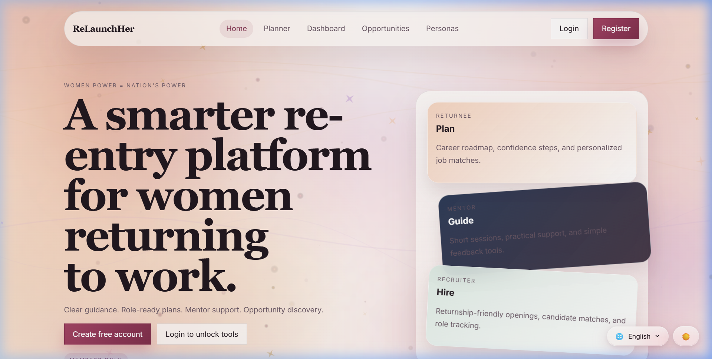
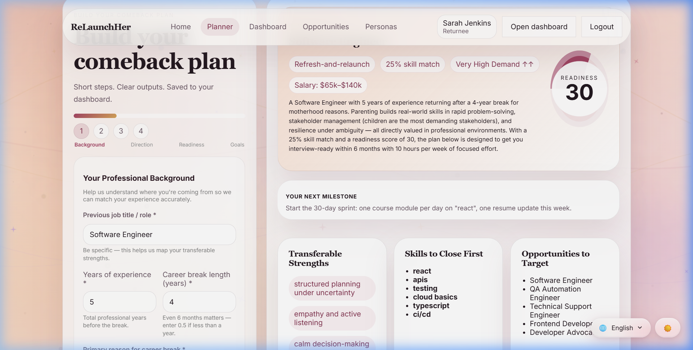
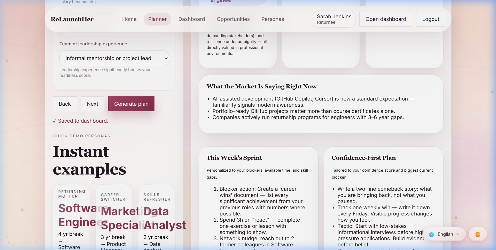
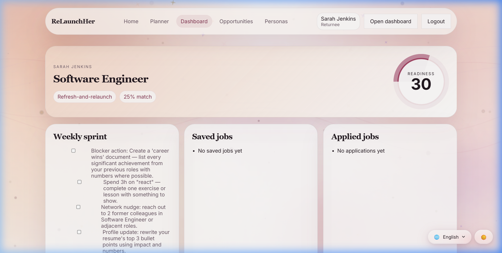
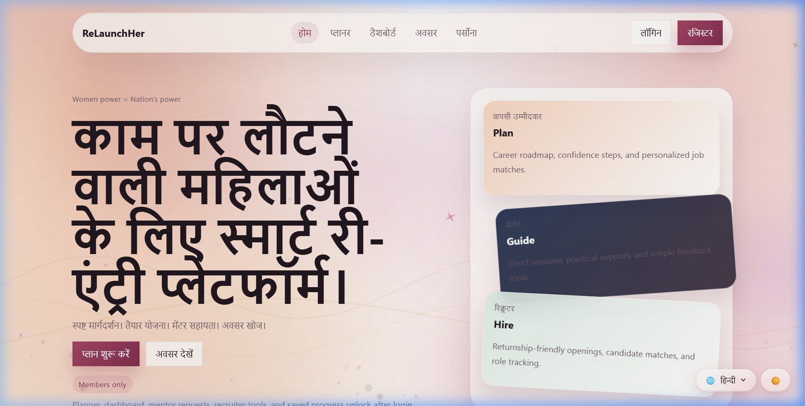
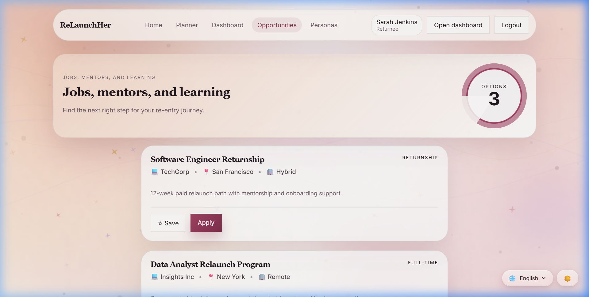
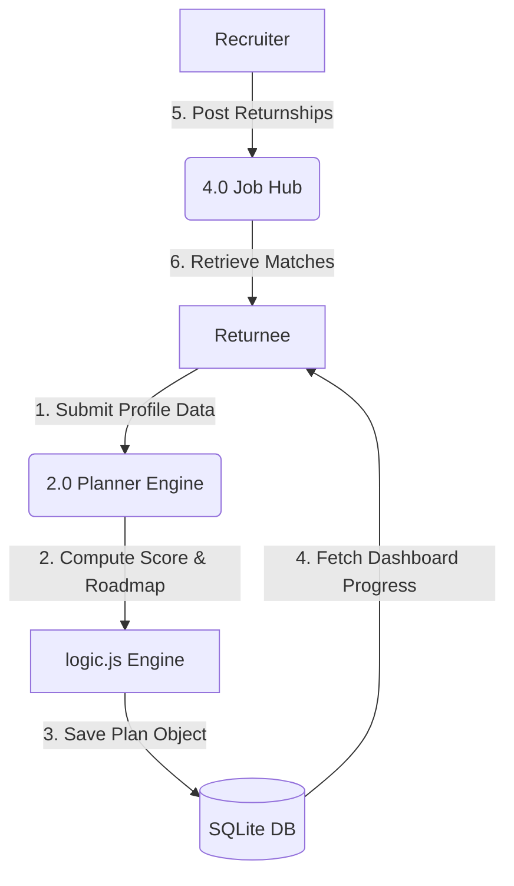
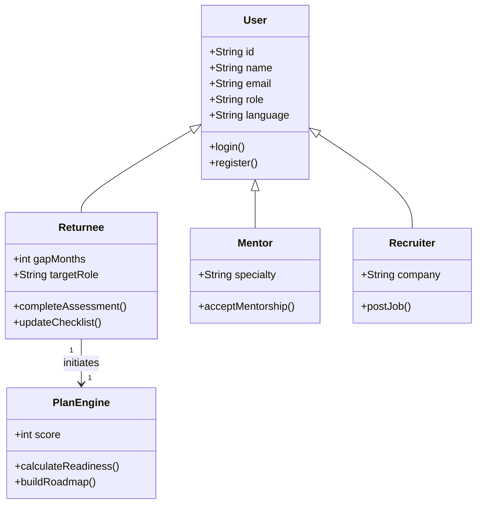
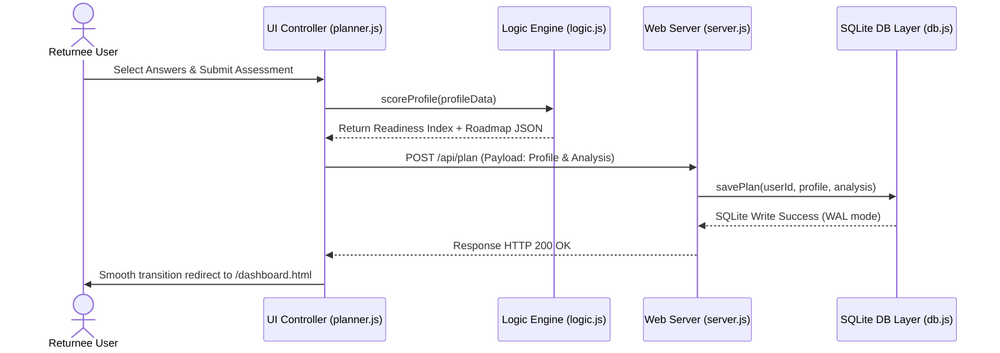

<div align="center">
  
  <h1>🌸 ReLaunchHer 🌸</h1>
  <p><strong>A Premium Role-Based Job Re-Entry Platform & Dynamic Career Planner for Women Returning to Work</strong></p>
  <p>
    <a href="#-key-features">Features</a> •
    <a href="#-ui-showcase">UI Showcase</a> •
    <a href="#-system-architecture">Architecture</a> •
    <a href="#-the-logic-engine">Logic Engine</a> •
    <a href="#-database-schema">Database</a> •
    <a href="#%EF%B8%8F-installation--setup">Getting Started</a>
  </p>
</div>


---

**ReLaunchHer** is a highly interactive, responsive, and multilingual web application designed to bridge the career gap for women returning to the workforce. By employing a comprehensive multi-factor inference engine, ReLaunchHer goes beyond typical job search boards. It provides returnees with personalized career readiness scoring, custom-synthesized 30/60/90-day roadmaps, targeted skill gap remediation, and a supportive mentorship/recruiter ecosystem.

---

## 🌟 Key Features

| Feature | Description | Details |
| :--- | :--- | :--- |
| **🔐 Role-Based Access Control** | Tailored dashboards and features based on user personas. | **Returnee:** Career tools, checklist tracker, and job hub.<br>**Mentor:** Manage mentorship requests and profiles.<br>**Recruiter:** Post jobs and view matching relaunch applicants. |
| **🧠 Intelligent Scoring Engine** | A weighted multi-factor inference engine calculating a **Readiness Index (0–100%)**. | Evaluates 13 independent dimensions, including career break reasons (motherhood, caregiving, etc.), experience, skill match, and confidence. |
| **📅 Guided Comeback Planner** | A sleek 4-step dynamic assessment wizard. | Gathers quantitative and qualitative data to synthesize customized, actionable career pathways. |
| **🚀 30/60/90-Day Roadmap** | Automatically generated sprints based on the profile analysis. | Provides step-by-step career milestones, actionable tactics, and links to learning resources. |
| **🌐 Multilingual UI** | Full localization support for major Indian languages. | Toggle seamlessly between **English, Hindi, Telugu, Malayalam, Tamil, Odia, and Bangla** to ensure broad accessibility. |
| **💼 Opportunities Hub** | Job listings, mentor matching, and curated courses. | Displays personalized job openings matching the user's target profile, mentor matches, and specialized upskilling catalogs. |
| **🎭 Persona Demo Mode** | Instant simulation sandbox for testing different user scenarios. | Pre-configured profiles (Anjali, Fatima, Meera) to immediately showcase how the logic engine adapts to different backgrounds. |

---

## 📸 UI Showcase

Experience the premium glassmorphism interface and fully responsive screens of ReLaunchHer:

### 1. Welcome & High-Contrast Landing Page
The user interface is designed with highly polished glassmorphism cards, premium HSL-tailored color gradients, and micro-animations to create a premium first impression.


### 2. Multi-Step Dynamic Comeback Planner
A 4-step interactive wizard that guides returnees through their background, career breaks, upskilling, and target job parameters without overwhelming them.


### 3. Personalized Scoring & 30/60/90-Day Roadmap Results
Upon completing the planner, the logic engine immediately evaluates their profile, presenting a precise **Readiness Score** alongside an actionable monthly career accelerator roadmap.


### 4. Interactive Returnee Dashboard & Checklist Tracker
A high-productivity hub where returnees can track their weekly progress sprints, document professional wins, and manage notes.


### 5. Multilingual Localization (Hindi UI Demo)
With a single click, the entire platform switches localizations. ReLaunchHer is localized across 7 Indian languages to democratize access for women across diverse regions.


### 6. Job, Mentor, & Upskilling Opportunities Hub
A comprehensive center listing active returnship jobs, expert mentor profiles, and targeted learning resources matching the returnee's target role.


---

## 📐 System Architecture

ReLaunchHer uses a structured three-tier architecture combining a Node.js server, an optimized SQLite storage layer, and modern semantic HTML5 frontend controllers.

### Data Flow Diagram (DFD Level 1)


### UML Class Diagram


### Sequence Diagram: Assessment Flow


---

## 🧠 The Logic Engine (The "Brain")

The heart of **ReLaunchHer** is the rule-based inference engine defined in `logic.js`. It calculates a highly normalized **Readiness Score (0–100%)** based on a weighted sum of 13 independent dimensions:

1. **Experience Depth (20%):** Evaluates depth with `Years * 2.5` (max 20 pts).
2. **Break Penalty (-20%):** Calculated as `GapYears * 4` (max -20 pts).
3. **Break Mitigation & Grace Rules:** The penalty is automatically reduced by **40% to 60%** if the gap category involves "Education" or "Entrepreneurship/Freelancing", or if skills are actively kept up-to-date.
4. **Skill Currency & Match (22%):** Computes fuzzy matching against a rigorous required skill catalog across 12 unique professional roles.
5. **Self-Reported Confidence (12%):** Adjusts readiness and synthesizes psychological support actions.
6. **Education Level (8%):** Maps credentials (diploma, bachelor's, master's, PhD) to baseline points.
7. **Leadership Exposure (8%):** Awards bonuses for previous informal mentoring, team lead, or management roles.
8. **Networking Activity (6%):** Factors in active networking, warm outreach, or light connections.
9. **Profile Status (6%):** Evaluates the completeness of the user's resume and LinkedIn profile.
10. **Weekly Time Commitment (6%):** Evaluates how many hours the returnee can commit to upskilling.
11. **Certifications Held (4%):** Incorporates professional certifications held.
12. **Support System (4%):** Incorporates existing childcare or community support.
13. **Transition Complexity Modifier:** Adjusts complexity based on whether they are pursuing the same role (`+4`), an adjacent role (`0`), or a full career pivot (`-4`).

---

## 🗄️ Database Schema

We use **SQLite** with the synchronous and high-performance `better-sqlite3` driver. The database runs in **Write-Ahead Logging (WAL)** mode to handle concurrent client sessions seamlessly with zero external configuration.

```sql
-- Core user accounts
CREATE TABLE IF NOT EXISTS users (
  id         TEXT PRIMARY KEY,
  name       TEXT NOT NULL,
  email      TEXT NOT NULL UNIQUE COLLATE NOCASE,
  password   TEXT NOT NULL,
  role       TEXT NOT NULL DEFAULT 'returnee',
  language   TEXT NOT NULL DEFAULT 'en',
  created_at TEXT NOT NULL
);

-- Hashed session tracking
CREATE TABLE IF NOT EXISTS sessions (
  token      TEXT PRIMARY KEY,
  user_id    TEXT NOT NULL REFERENCES users(id) ON DELETE CASCADE,
  created_at TEXT NOT NULL,
  expires_at TEXT NOT NULL
);

-- Saved planner assessment outcomes
CREATE TABLE IF NOT EXISTS plans (
  id         INTEGER PRIMARY KEY AUTOINCREMENT,
  user_id    TEXT NOT NULL REFERENCES users(id) ON DELETE CASCADE,
  profile    TEXT NOT NULL,  -- JSON string of assessment details
  analysis   TEXT NOT NULL,  -- JSON string of Readiness score & Roadmaps
  saved_at   TEXT NOT NULL
);

-- Returnee roadmap progress & wins
CREATE TABLE IF NOT EXISTS progress (
  user_id    TEXT PRIMARY KEY REFERENCES users(id) ON DELETE CASCADE,
  checklist  TEXT NOT NULL DEFAULT '{}', -- JSON tracking checked roadmap items
  notes      TEXT NOT NULL DEFAULT '',
  wins       TEXT NOT NULL DEFAULT '[]',   -- JSON tracking user milestones
  updated_at TEXT NOT NULL
);

-- Job saving & application tracker
CREATE TABLE IF NOT EXISTS job_states (
  user_id TEXT PRIMARY KEY REFERENCES users(id) ON DELETE CASCADE,
  saved   TEXT NOT NULL DEFAULT '[]', -- JSON list of saved job IDs
  applied TEXT NOT NULL DEFAULT '[]'  -- JSON list of applied job IDs
);
```

---

## 🛠️ Installation & Setup

### Prerequisites
Make sure you have **Node.js (v18 or higher)** installed on your machine.

### 1. Clone & Install Dependencies
```bash
# Clone the repository
git clone https://github.com/PrateekPulkit/ReLaunchHer.git
cd ReLaunchHer

# Install packages
npm install
```

### 2. Seed the Database
Initialize the SQLite schema and seed mock jobs, recruiters, and mentors:
```bash
node seed-db.js
```

### 3. Run Locally
Start the development server:
```bash
npm run dev
# or
npm start
```
Open your browser and navigate to **`http://localhost:3000`** to view the application.

### 4. Run Automated Heuristic Tests
Verify the logic scoring model and inference edge cases via built-in unit tests:
```bash
npm test
```

---

<div align="center">
  <p>Made with ❤️ to support and accelerate women's career re-entry paths globally.</p>
</div>
