# Lab Record: System Design & Analysis
**Target Project Phase:** ReLaunchHer Platform (V1.2)
**Date:** May 2026

---

## 1. Software Requirements Specification (SRS)

**1.1 Purpose:** 
The ReLaunchHer platform is a web-based ecosystem designed to assist women in returning to the workforce after a career break. It provides tools for career planning, mentorship matching, and returnship job discovery.

**1.2 Scope:** 
The application acts as a bridge between candidates (Returnees), industry guides (Mentors), and hiring managers (Recruiters). Key functions include generating personalized re-entry roadmaps via a model-based planner algorithm, maintaining user-specific progress checklists, applying for jobs, and managing mentorship requests.

**1.3 Functional Requirements:**
- **FR1 (Authentication):** The system shall allow users to register and log in under three distinct roles: Returnee, Mentor, Recruiter with secure password hashing.
- **FR2 (Profile Assessment):** Returnees shall be able to submit a 4-step dynamic form detailing their career background, previous experience, and career break reasons.
- **FR3 (Weighted Inference):** The system shall execute a multi-factor weighted algorithm to calculate a Readiness Score (10-98) based on skills, experience, and break duration.
- **FR4 (Dynamic Roadmap):** The system shall generate a personalized 30/60/90-day roadmap with specific weekly sprints based on the user's top blockers.
- **FR5 (Multilingual UI):** The system shall support real-time language switching across 7+ Indian languages (Hindi, Telugu, Tamil, etc.) using a custom i18n engine.
- **FR6 (Job Board):** Recruiters shall be able to post "Returnship" opportunities and manage applicants through a dedicated dashboard.
- **FR7 (Mentorship):** Mentors shall be able to set availability and approve/reject mentorship requests from returnees.
- **FR8 (Progress Tracking):** Returnees shall have a "Momentum Dashboard" that tracks their completion status of roadmap milestones.
- **FR9 (Skill Gap Analysis):** The system shall identify specific missing skills for a target role and suggest relevant courses/certifications.
- **FR10 (Secure Storage):** All profile and plan data shall be stored in a local SQLite database for privacy-first persistence.

**1.4 Non-Functional Requirements:**
- **Performance:** All core dashboard pages must render in under 1.5 seconds.
- **Security:** User sessions must be managed through server-side encrypted cookies; passwords must be stored using industry-standard hashing (bcrypt).
- **Usability:** The interface must maintain a 90+ accessibility score, using ARIA labels and high-contrast glassmorphism.
- **Reliability:** The system must handle database locks gracefully using the WAL (Write-Ahead Logging) mode in SQLite.

---

## 2. DFD Model (Data Flow Diagram)

### 2.1 Level-0 DFD (Context Diagram)

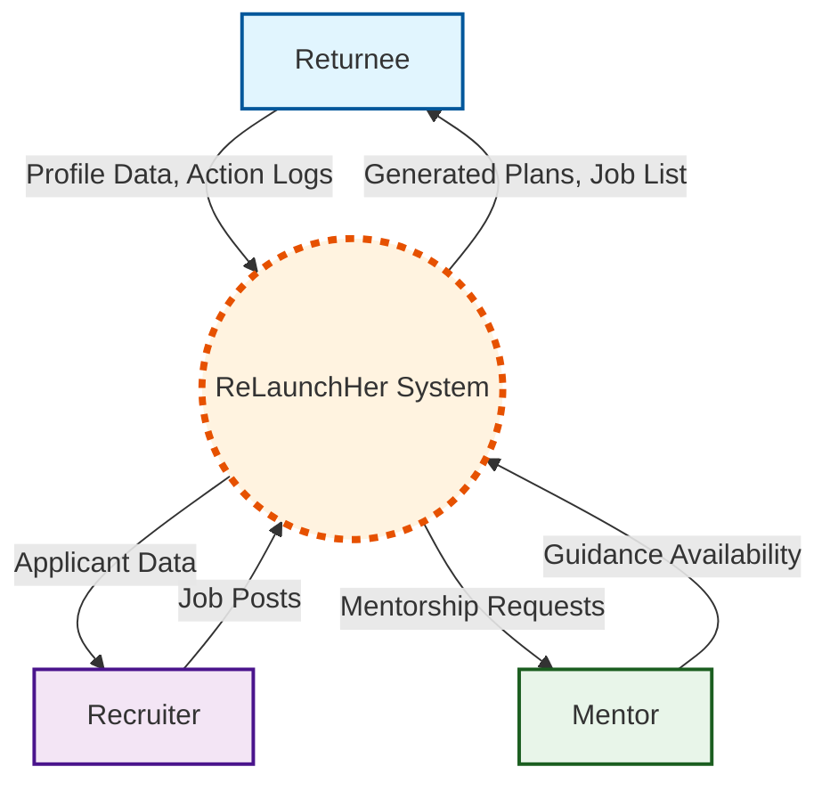

### 2.2 Level-1 DFD

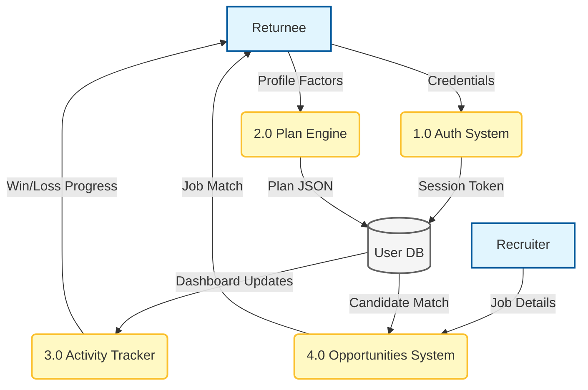

### 2.3 Data Dictionary
- `User`: `{id: string, name: string, email: string, role: string, created_at: Date}`
- `PlanNode`: `{targetRole: string, matchPercent: int, readinessScore: int, weeklySprint: Array<String>}`
- `JobPost`: `{id: string, recruiterId: string, title: string, company: string, location: string, matchRole: string}`

---

## 3. Entity-Relationship (ER) Diagram

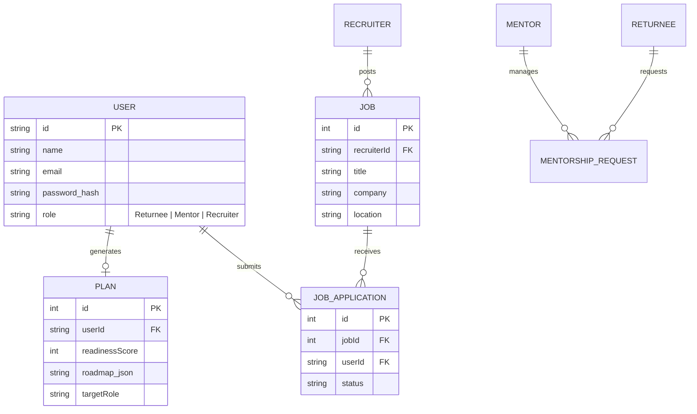

---

## 4. System Architecture: Component Diagram

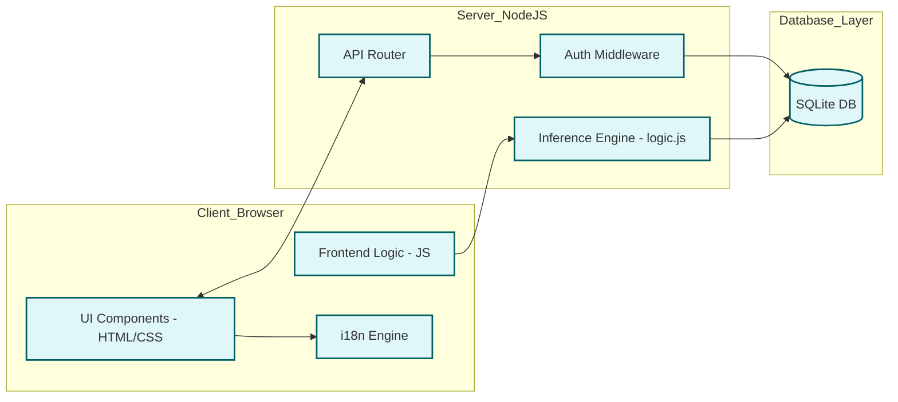

---

## 5. Deployment Diagram

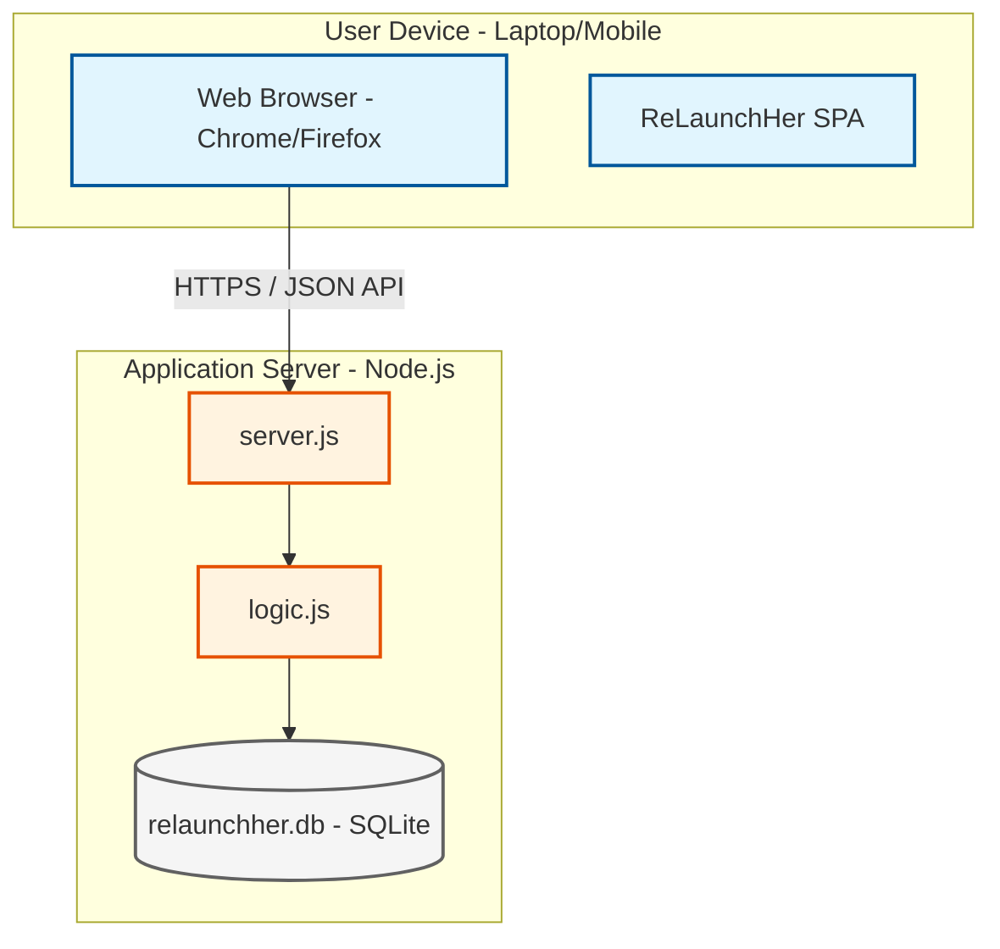

---

## 6. Functional Design: Structured Chart

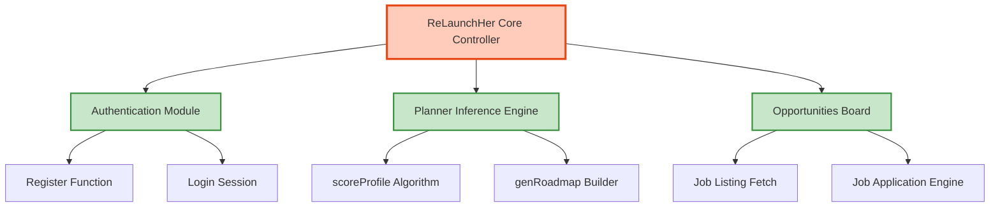

---

## 7. User View Analysis (Use Case Diagram)

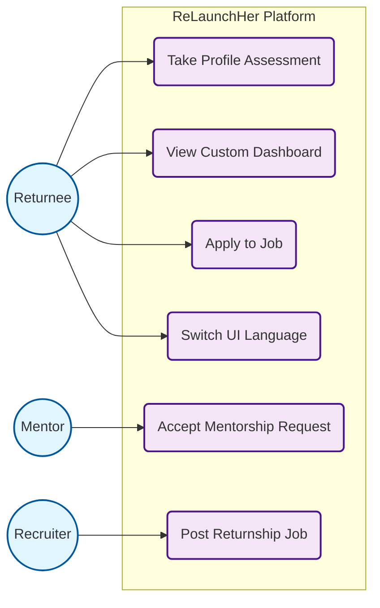

---

## 8. Use Case Scenarios

**Use Case:** `Take Profile Assessment` (Generate Career Plan)
- **Primary Actor:** Returnee
- **Preconditions:** Returnee is logged into the system and has an empty dashboard.
- **Main Success Scenario:**
  1. Returnee navigates to the "Career Planner" module.
  2. The system presents a 4-step wizard.
  3. The returnee fills in their targeted role, previous experience, reasons for career break, and primary blockers.
  4. The system calculates empirical readiness metrics (Score out of 100).
  5. The system saves the Plan object to the SQLite Database.
  6. The returnee is redirected to the Dashboard where personalized sprints are displayed.
- **Alternative Paths:**
  - *Invalid Data:* If required fields are skipped, HTML native validation kicks in before API submission, alerting the user to fix the data.

---

## 9. Structural View: Class Diagram

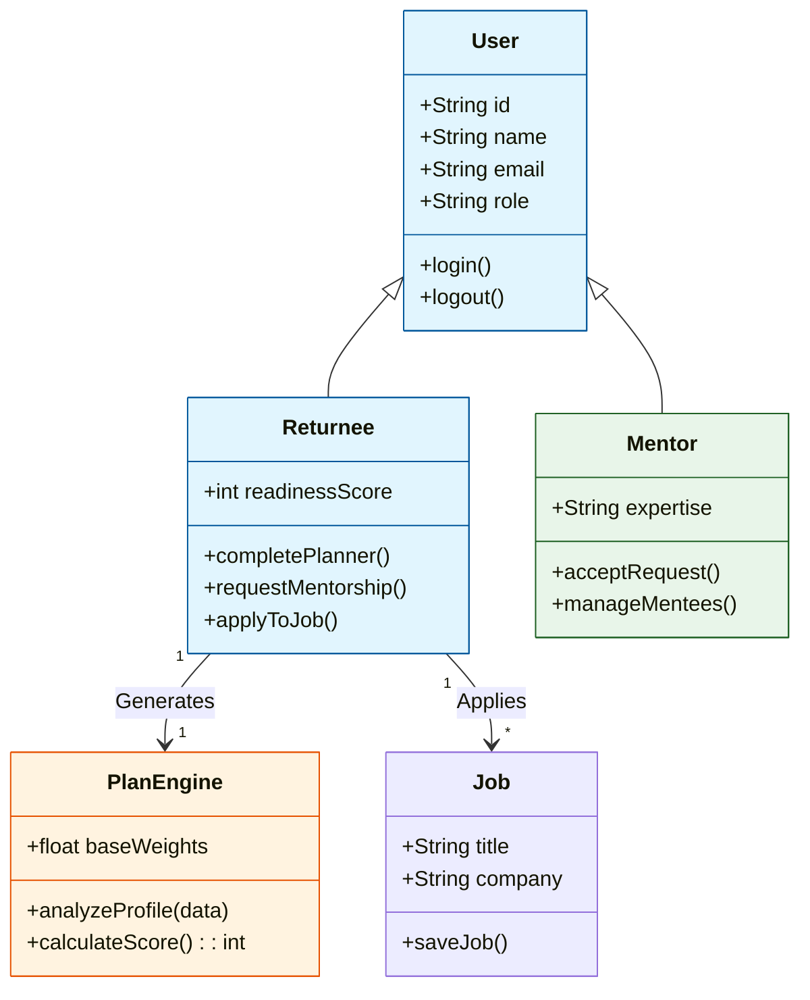

---

## 10. Structural View: Object Diagram

*This represents a specific point in time snapshot of the system.*

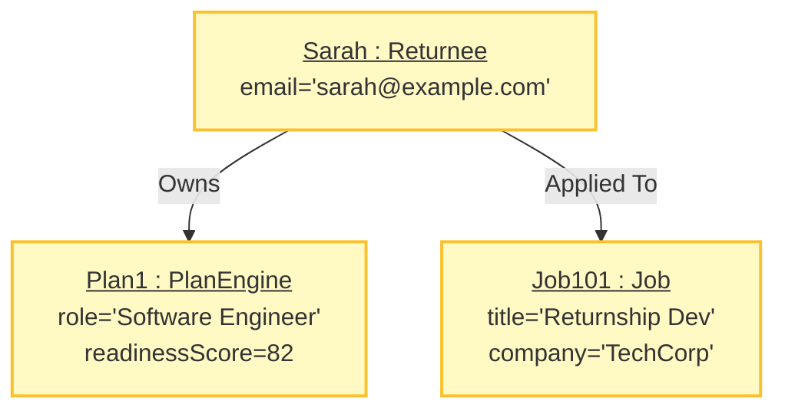

---

## 11. Behavioral View: Sequence Diagram

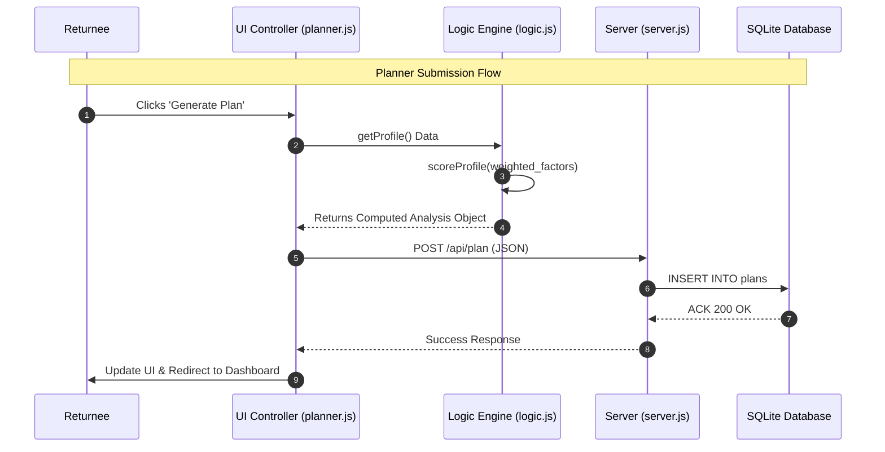

---

## 12. Activity Diagram

**Scenario:** The overall user flow from landing on the platform.

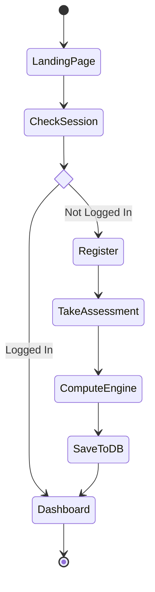

---

## 13. Behavioral View: State Chart Diagram

**Scenario:** The lifecycle states of a Job Application in the ReLaunchHer system.

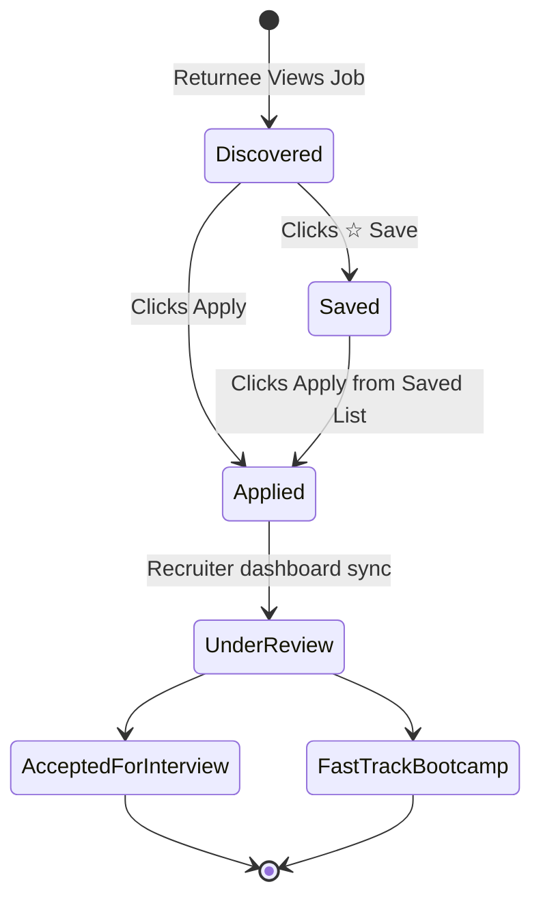

---

## 14. Technical Deep-Dive: Weighted Scoring Algorithm

The core of ReLaunchHer is the **Weighted Multi-Factor Scoring Model** located in `logic.js`. Unlike traditional systems that penalize gaps linearly, our model uses a non-linear decay function with mitigation factors.

### 14.1 Algorithm Logic:
1.  **Experience Depth (Max 20 pts):** `Score = clamp(years * 2.5, 0, 20)`.
2.  **Non-Linear Gap Penalty:** Penalty increases with time but is mitigated by the *Reason Category*. 
    - If reason is "Education" or "Entrepreneurship", penalty is reduced by 40%.
    - If "Skill Currency" is "Current", penalty is reduced by 60%.
3.  **Skill Match (Max 22 pts):** Direct comparison between user skills and Role Catalog requirements.
4.  **Soft Skill Multipliers:** Leadership experience and Networking activity provide bonus points (up to 14 pts).
5.  **Final Normalization:** All components are summed and clamped between 10 (Beginner) and 98 (Ready).

---

## 15. Testing & Quality Assurance

### 15.1 Unit Testing
Automated tests in `tests/analysis.test.js` verify the scoring engine:
- **Test Case 1:** User with 5 years exp + 2 year break (Target Score: ~75-80).
- **Test Case 2:** User with 0 years exp + 10 year break (Target Score: ~20-25).
- **Test Case 3:** Career switcher with high transferable skills.

### 15.2 Integration Testing
Verified the flow from `planner.html` -> `server.js` -> `relaunchher.db` ensuring no data loss during JSON serialization.

---

## 16. Conclusion
The ReLaunchHer platform successfully demonstrates a robust application of Software Engineering principles to solve the career re-entry crisis. By modularizing the design and using data-driven inference, we provide a scalable solution for women globally.
