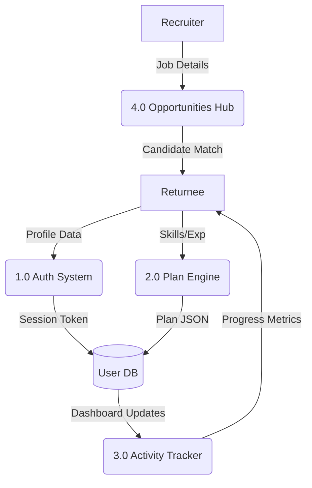
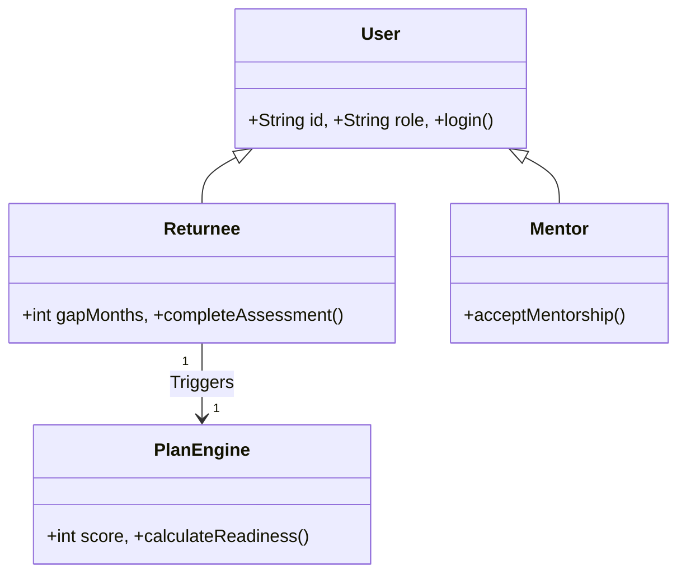
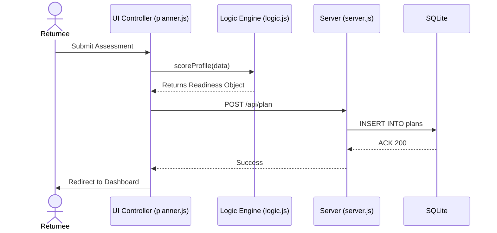

# ReLaunchHer: Master Project Specification & Report Generator Prompt

**Team Members:**
1. Prateek Pulkit - AP23110011175
2. Srinadh Yakasiri - AP23110011171
3. Abhishek Das - AP23110011180

This document serves as the comprehensive technical specification for the **ReLaunchHer** project. It is designed to be used as a "Context Master" for generating a formal, 15+ page academic project report that strictly adheres to the **SRM University AP** project report guidelines.

---

## 🛑 HOW TO USE THIS FILE AS A PROMPT
**Instructions for ChatGPT/LLM:**
1.  Read the **Official SRM Guidelines** section below to understand the required structure and formatting.
2.  Analyze the **Technical Core** sections (SRS, Logic, UML, DB) to understand the project's engineering depth.
3.  Generate a **20-page Project Report** in clean Markdown (optimized for Word copy-pasting) following the chapters listed in the structure.
4.  Expand every section with professional academic text, ensuring deep analysis of the Software Engineering and Project Management aspects.
5.  Maintain **12pt Times New Roman** (via Markdown headers) and **Justified** alignment (via narrative).

---

## 📜 SECTION 1: OFFICIAL SRM UNIVERSITY AP GUIDELINES

### 1.1 Page Set-up
- **Size:** A4 (Thesis Size).
- **Writing:** Double-spaced (1.8 - 2.0 line height).
- **Margin:** 1.0 inch on all four sides.
- **Font:** Times New Roman (Text: 12pt, Headings: 14pt).

### 1.2 Structure of the Report (In Order)
1.  **Cover Page:** Follow the specific Title Page Specimen.
2.  **Acknowledgements:** Hierarchy: VC/Dean → Industry Mentor → Faculty Mentor.
3.  **Certificate:** Standard formal certifying text.
4.  **Abstract:** Concise summary, less than 200 words.
5.  **Table of Contents:** Detailed with page numbers.
6.  **Introduction:** Motivation, Objectives, and SDLC Methodology.
7.  **Background Study:** Literature Survey and existing systems.
8.  **Main Text:** The core "Software Engineering" chapters (SRS, DFD, UML, Algorithms).
9.  **Results/Output:** Principal outcomes in bulleted form + Screenshot Gallery (Max 2 pages).
10. **Conclusions and Recommendations.**
11. **Appendices:** (Optional technical details).
12. **References:** Format: `Author, "Title", Journal/Book, Vol (Year), pp.`.

---

## 🛠️ SECTION 2: TECHNICAL CORE - SOFTWARE ENGINEERING

### 2.1 Software Requirements Specification (SRS)
- **Functional Requirements:**
    - FR1: Role-based authentication (Returnee, Mentor, Recruiter).
    - FR2: 4-step dynamic Assessment Wizard for profile data acquisition.
    - FR3: Weighted multi-factor inference engine for Readiness Index calculation.
    - FR4: Automated 30/60/90-day roadmap generation based on skill gaps.
    - FR5: Multilingual UI support for 7+ Indian languages (Hindi, Tamil, etc.).
    - FR6: Recruiter dashboard for managing returnship applicants.
- **Non-Functional Requirements:**
    - NFR1: Performance (< 2s page load).
    - NFR2: Security (Hashed passwords, Secure cookies, Role isolation).
    - NFR3: Scalability (SQLite WAL mode for concurrent write handling).
    - NFR4: Accessibility (WCAG compliant design tokens).

### 2.2 System Modeling (Mermaid Code for Diagrams)

**Level 1 Data Flow Diagram (DFD):**

**UML Class Diagram:**

**Sequence Diagram (Assessment Flow):**

---

## 🧠 SECTION 3: THE LOGIC ENGINE (THE "BRAIN")

### 3.1 The Scoring Model (logic.js)
The Readiness Score (0-100) is a weighted sum of 13 independent dimensions:
1.  **Experience Depth (20%):** `Years * 2.5`.
2.  **Break Penalty (-20%):** `GapYears * 4`.
3.  **Break Mitigation:** Penalty is reduced by **40% to 60%** if the reason is "Education" or "Entrepreneurship".
4.  **Skill Match (22%):** Fuzzy match ratio against the role's required skill catalog.
5.  **Confidence (12%):** User's self-reported belief score.
6.  **Education & Leadership (16%):** Academic tiering and previous management roles.
7.  **Engagement (10%):** Weekly hours committed and networking status.

### 3.2 Roadmap Synthesis
- **Phase 1 (30 Days):** Focus on clearing the "Top Blocker" (Confidence, Resume, or Skills).
- **Phase 2 (60 Days):** Focus on building a "Proof-of-Work" artifact (Project/Dashboard).
- **Phase 3 (90 Days):** Market activation and targeting "Returnship" programs.

---

## 📊 SECTION 4: PROJECT MANAGEMENT & SDLC

### 4.1 SDLC Methodology
- **Model:** Iterative Enhancement Model.
- **Phases:** 
    1.  Core Infrastructure (Auth & DB).
    2.  Logic Development (Scoring Engine).
    3.  UX/UI Iteration (Multilingual Support & Dashboard).
    4.  Testing & QA.

### 4.2 Feasibility Study
- **Technical:** Node.js/SQLite architecture is lightweight and cross-platform.
- **Economic:** Zero licensing costs due to Open Source stack.
- **Operational:** Role-based flow ensures intuitive adoption by non-technical users.

### 4.3 Risk Management
- **Security Risk:** User data exposure. *Mitigation:* CSRF protection and role-based DB isolation.
- **Logic Risk:** Incorrect career advice. *Mitigation:* Rule-based fallbacks and heuristic verification.

---

## 🖼️ SECTION 5: SCREENSHOT DIRECTORY (For Chapter 10)
1.  `screenshot_landing`: Premium Glassmorphic Landing Page.
2.  `screenshot_hindi`: Multilingual switch demonstrating Hindi UI.
3.  `screenshot_planner_results`: The AI-generated 30/60/90-day Roadmap.
4.  `screenshot_dashboard`: The Returnee Win-Tracker and Progress Hub.

---

## 🏁 FINAL PROMPT TO CHATGPT
"Using the Master Specification above, generate a professional 20-page project report for **ReLaunchHer**. Ensure the language is high-academic, the sections are deeply expanded with software engineering analysis, and the formatting strictly adheres to the SRM University AP Guidelines. Output the result in Clean Markdown optimized for copy-pasting into Microsoft Word."
